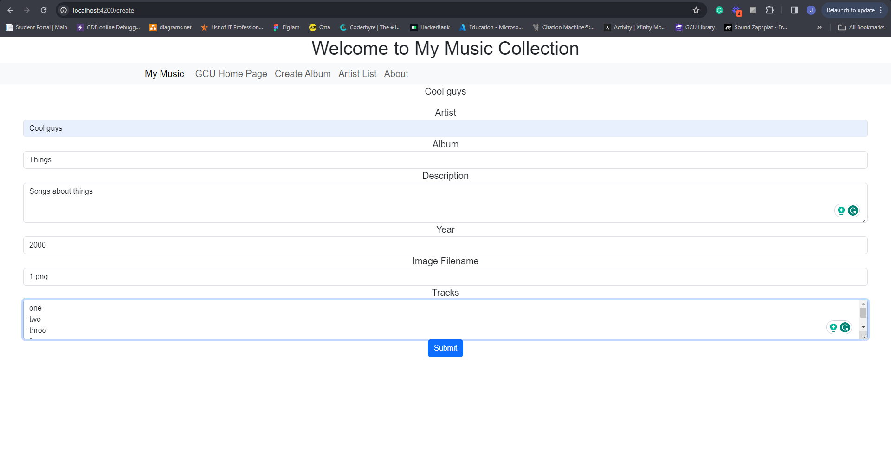
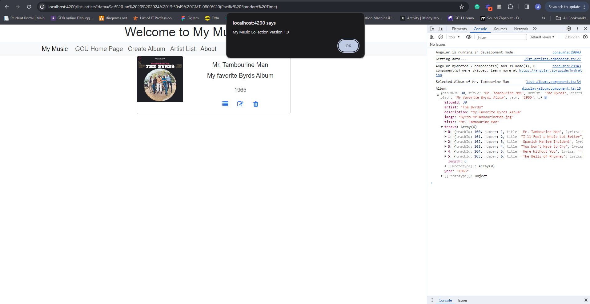
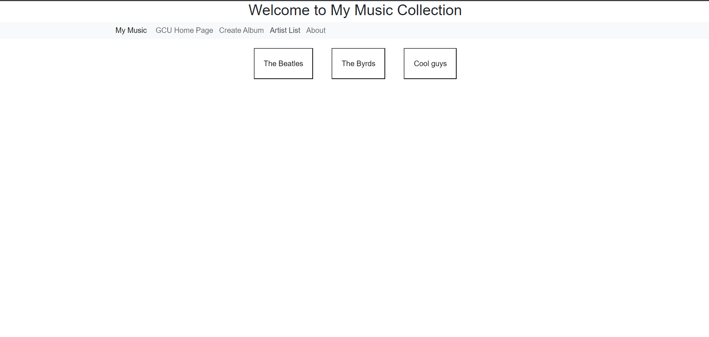
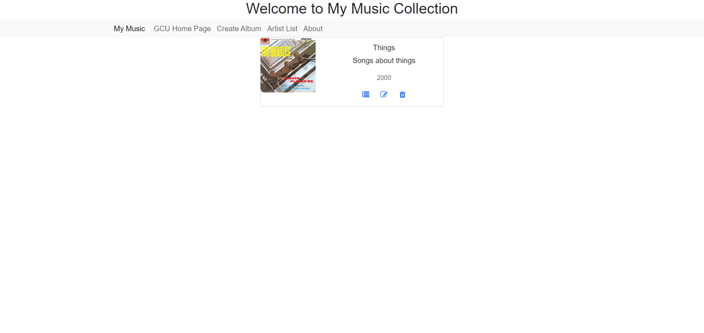

# CST391-Activity
## Activity 3 2024/1/21

I couldn't figure out why the tracks are not showing. It is something to do with the display-album.component.html page on the bottom where it has an *ngIf.  For some reason it won't display the tracks even though the tracks are printing out correctly in the console log.
I didn't implement delete, but the delete page renders; it just doesn't actually delete the album. 

Create new album

About alert

List albums after creating one

View the new album I created

Link to GCU
