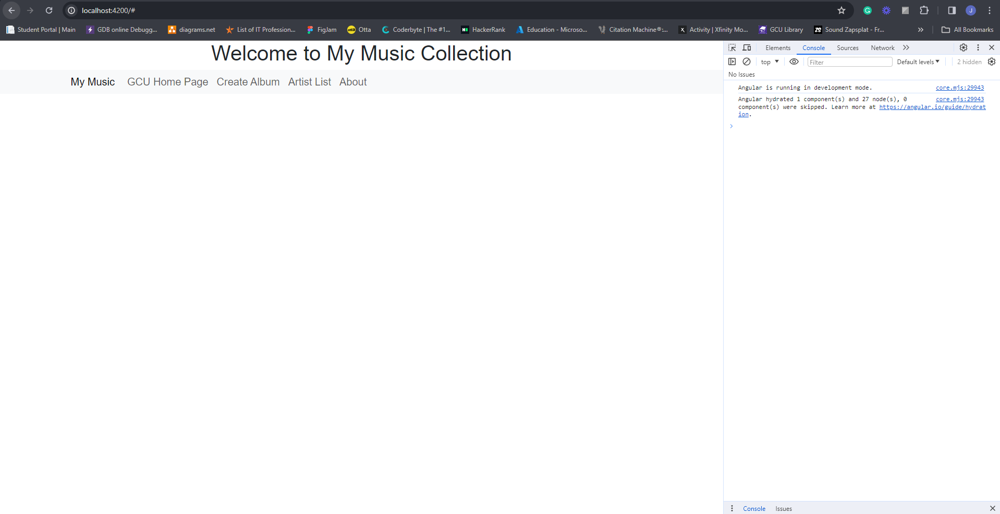
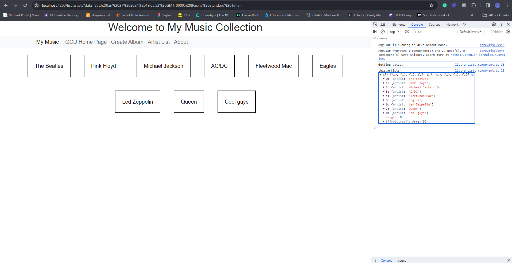
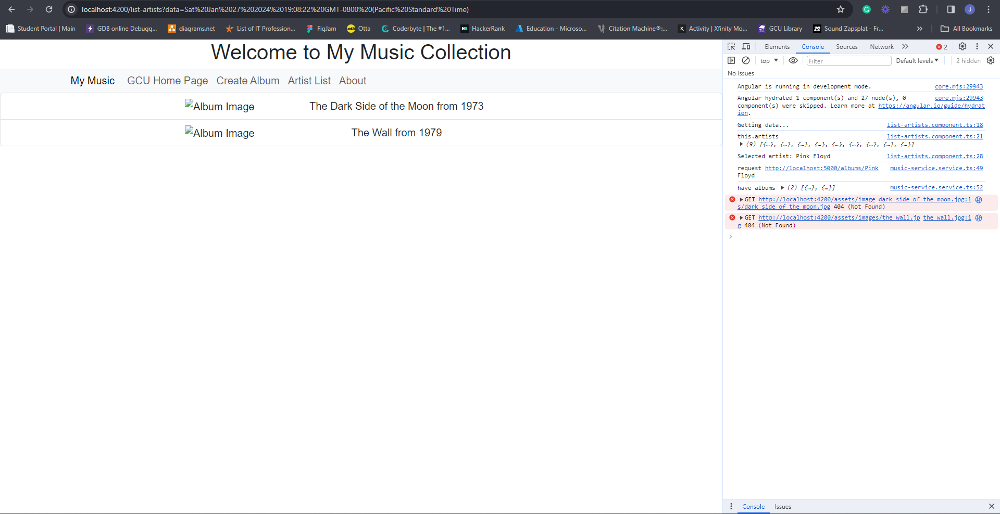
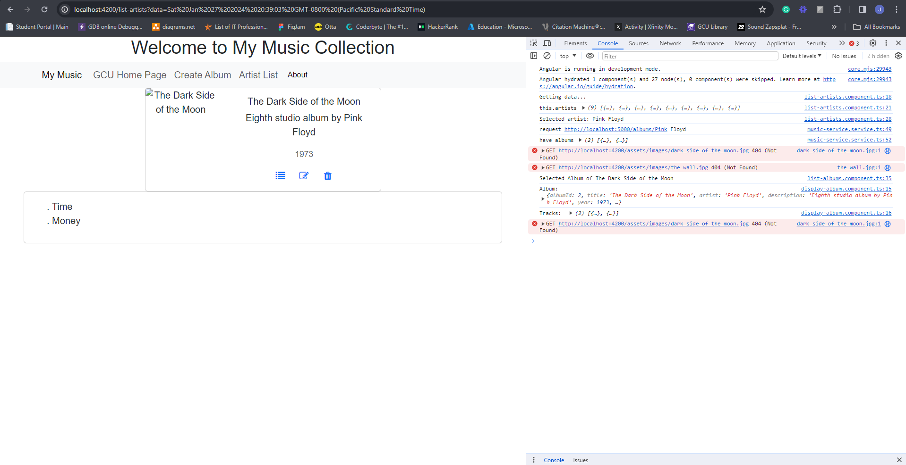
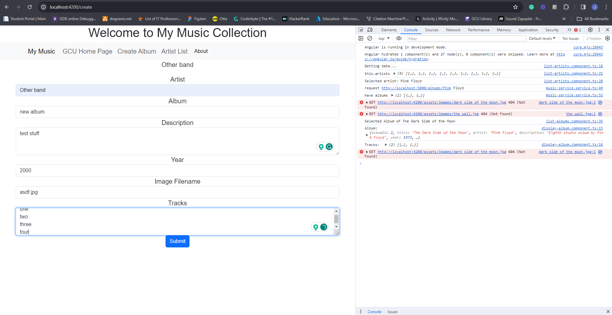
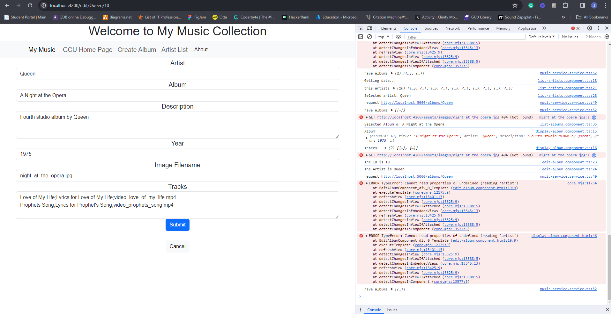

# CST391-Activity

## Activity 4 2024/1/28
Still having issues with the tracks showing with the toggle.  I just got rid of the toggle class to show that the tracks are being returned and display correctly.  So, something is wrong with the toggle.

Main

Artist List

Albums List

Display ALbum

Create Album

Edit Album

Delete Album

### Research question:
In Angular applications that work with a database, certain operations, like logging in or refreshing data, often involve using callbacks or promises. For instance, when a user logs in, the application may need to check the user's credentials in the database. The outcome of this operation is then communicated to different parts of the application through callbacks or observables.
When the application needs to interact with the database, it does so through HTTP requests. These requests are a way for the application to get or send data to the database. So, when users do things like requesting information or updating data, the application communicates with the database using HTTP requests. This ensures that the application and the database work together smoothly.

## Activity 3 2024/1/21

I couldn't figure out why the tracks are not showing. It is something to do with the display-album.component.html page on the bottom where it has an *ngIf.  For some reason it won't display the tracks even though the tracks are printing out correctly in the console log.
I didn't implement delete, but the delete page renders; it just doesn't actually delete the album. 

Create new album

About alert

List albums after creating one

View the new album I created

Link to GCU
