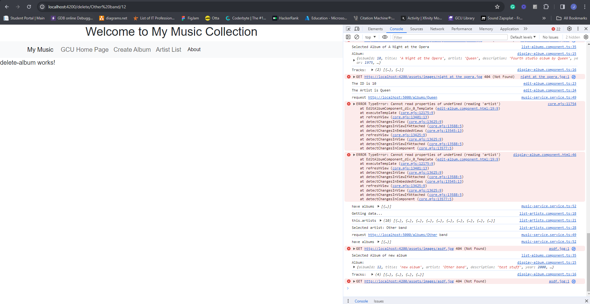

# CST391-Activity

## Activity 6 2024/2/11
I'm still enjoying React!  It feels like it just makes much more sense to me than Angular for some reason.  Hooks are great!  Just initialize the original state value, then pass the mutating method and the new value with every state change.  

We were able to use a dataSource file that gets the JSON data from the Express API that is running and gets data from the MAMP server using axios.  This is set into motion with the useEffect hook calling the loadAlbums function which uses the dataSource object to asynchronously get all the albums (dataSource.get('/albums')) from the Express server and call the setAlbumList function to turn that JSON into an array and update the state of the albumList array.  Then when the div element in the return portion of App.js calls the renderedList function Card objects are displayed using the album data. 
This is shown in the image below:


Then, every time the state changes in the search form, hooks are used to change the state of the inputText.  When the onSubmit is triggered inside the SearchForm, the renderedList function looks for any text in the searchPhrase and if there is a match in the album.description portion of the array, then those objects will be displayed.
Below is an example of searching for 'pink.'


<br>


<br>
<br>

## Activity 5 2024/2/4
So far React is much easier to understand than Angular; maybe the instructions are just more clear.  Everything is working as described at least.  Like Angular, React has a component design.  It appears that only 1 file per component is needed to define the function and view of the component.  The view portion uses the JSX 'language' to define what the component will look like.  JSX looks similar to HTML, "but is really Javascript that is unique to React," according to the activity instructions.  I really liked how easy it was to define component properties in the component and then define their values in the other component that is using it.  

Here's my first React App:


<br>

## First React Music App


We reused the Card component to insert album objects using an array of albums and then passing them into a function called renderedList.  
```
const renderedList = () => {
    return albumList.map((album) => {
      return (
        <Card
          albumTitle={album.title}
          albumDescription={album.description}
          buttonText='OK'
          imgURL={album.image}
        />
      );
    });
}
```

This function takes the entire albumList (that is currently hard coded) and returns Card objects using the album.title, album.description, and album.image for each of the albums in the array.  The map function reminds me of a forEach function except the map function creates a new array without changing the original array.  The forEach function can alter the original array, but will not create a new array.

<br>
<br>

## Activity 4 2024/1/28
Still having issues with the tracks showing with the toggle.  I just got rid of the toggle class to show that the tracks are being returned and display correctly.  So, something is wrong with the toggle.

Main


Artist List


Albums List


Display ALbum


Create Album


Edit Album


Delete Album


### Research question:
In Angular applications that work with a database, certain operations, like logging in or refreshing data, often involve using callbacks or promises. For instance, when a user logs in, the application may need to check the user's credentials in the database. The outcome of this operation is then communicated to different parts of the application through callbacks or observables.
When the application needs to interact with the database, it does so through HTTP requests. These requests are a way for the application to get or send data to the database. So, when users do things like requesting information or updating data, the application communicates with the database using HTTP requests. This ensures that the application and the database work together smoothly.


## Activity 3 2024/1/21

I couldn't figure out why the tracks are not showing. It is something to do with the display-album.component.html page on the bottom where it has an *ngIf.  For some reason it won't display the tracks even though the tracks are printing out correctly in the console log.
I didn't implement delete, but the delete page renders; it just doesn't actually delete the album. 

Create new album


About alert


List albums after creating one


View the new album I created


Link to GCU
